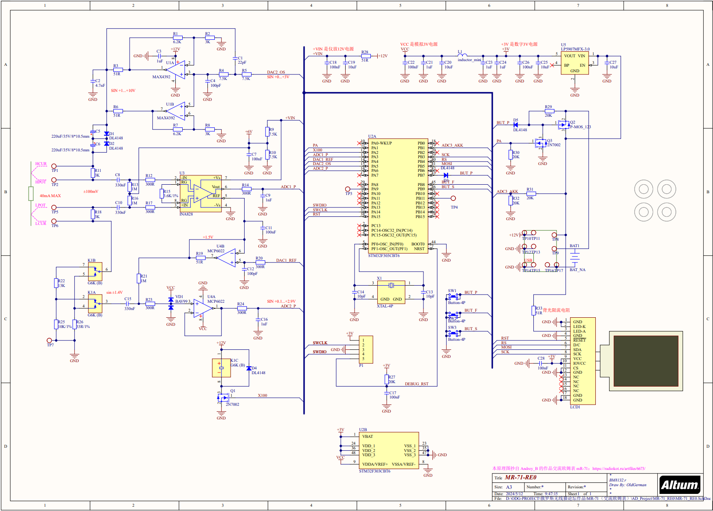
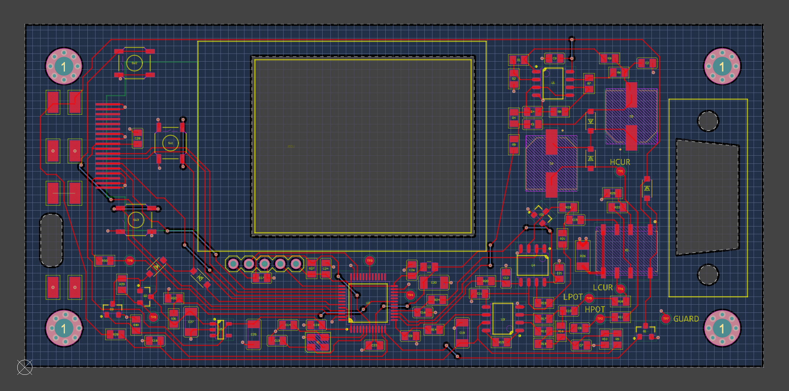
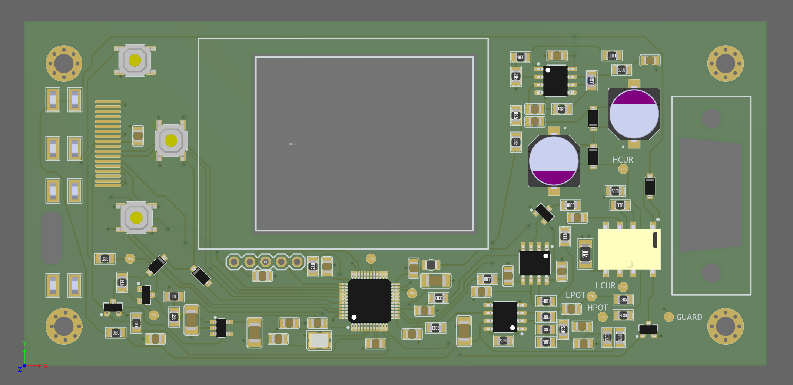

## 源文件说明：mR-71-RE0

原版 mR-71 的 PCB 和 SCH 作者 Andery_B 使用 Sprint-Layout 绘制，没有分享源文件，因此使用其他主流 EDA 演绎非常不方便

此文件夹下是我用 Altium 23.3.1 重绘的 原版 mR-71 工程，原理图遵循原版的风格，PCB按照原版的走线方式布通，但线宽过孔等未优化，**仅供参考，不保证做出来可以正常工作**，如果你想设计 原版 mR-71 的衍生版本，不如从这套源文件开始

