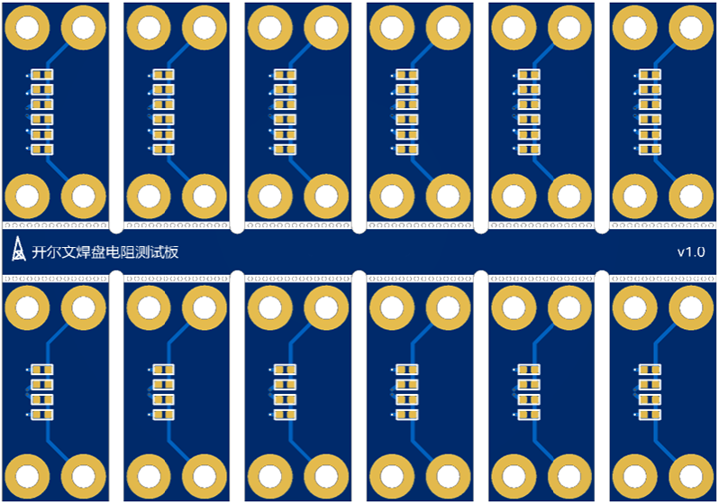

## Gerber文件说明：Kelvin_RES

### 文件名：组成

```c
AAAABBCC-DDEE_Kelvin_RES_v1.0.zip
^~~~^~^~ ^~^~ ^~~~~~~~~~ ^~~~ ^~~
年  月 日 时 分 名称        版本 格式
^~~~~~~~~~~~~
前缀
```

例如：20240314-1629_Kelvin_RES_v1.0 文件名的意思是：2024年3月14日Kelvin_RES第1.0版

### 文件名：前缀：日期

优先使用最新日期的文件，同一天日期后的小时分钟不分先后

### PCB预览

#### Kelvin_RES_v1.0

同时有2512和1206焊盘

| 正面                                                   | 反面                                                         |
| ------------------------------------------------------ | ------------------------------------------------------------ |
|  |  |

#### Kelvin_RES_1206_v1.0

只有1206焊盘

| 正面                                                         | 反面                                                         |
| ------------------------------------------------------------ | ------------------------------------------------------------ |
|  |  |

#### Kelvin_RES_2512_v1.0

只有2512焊盘

| 正面                                                         | 反面                                                         |
| ------------------------------------------------------------ | ------------------------------------------------------------ |
|  |  |