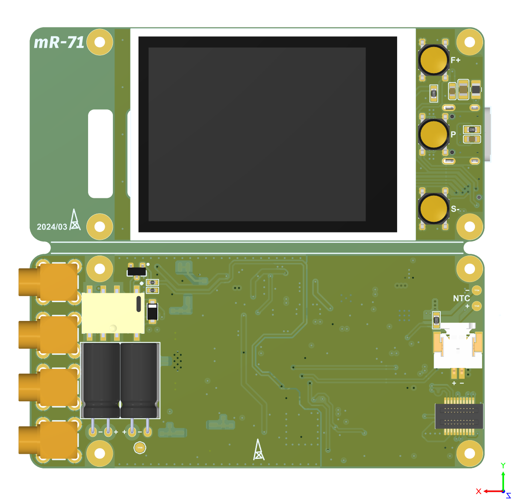
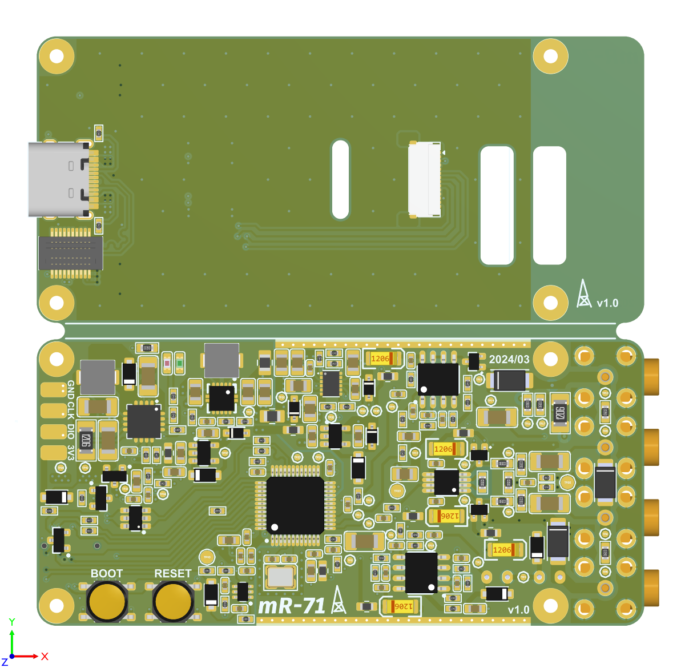

## mR-71-RE

![CC BY-SA 4.0][cc-by-sa-shield]

[cc-by-sa-shield]: https://img.shields.io/badge/License-CC%20BY--SA%204.0-lightgrey.svg

## 更新日志

| 日期      | 概述                          | 更新了啥                 | 备注                                                         |
| --------- | ----------------------------- | ------------------------ | ------------------------------------------------------------ |
| 2024-0319 | 首次发布                      | 主机PCB版本：v1.0        | 组装教程、3D打印外壳也都上传了                               |
| 2024-0321 | 更新主机PCB版本、钢网、原理图 | 主机PCB版本：v1.1        | 还添加了小于20%沉金面积版本，后缀Gold                        |
| 2024-0322 | 更新电阻测试                  | 在组装指南的测试部分更新 | 三个频率下测量：1%的1mΩ到100mΩ 采样电阻、0.1%的1Ω到1MΩ薄膜电阻 |

### 关于

mR-71 重制版的制造文件（mR-71 Remastered version manufacturing files）

你第一次接触到本套文件可能是压缩包，制造文件的版本可能滞后于仓库，制作前请访问[仓库地址](https://github.com/oldgerman/mR-71-RE)检查更新

The first time you come into contact with this set of files, it may be a compressed package, and the content may lag behind the warehouse. Please visit the [github](https://github.com/oldgerman/mR-71-RE) to check for updates before making

|  |  |
| ------------------------------------------------------ | ------------------------------------------------------ |

|  |  |
| -------------------------------------------- | -------------------------------------------- |

### 组装指南

[mR-71-RE组装指南.md](https://github.com/oldgerman/mR-71-RE/tree/master/mR-71-RE组装指南.md)

### 路径下各个文件夹的说明

```c
├─BOM                             // # PCB的物料清单
├─Gerber                          // # 打板文件
│  ├─Kelvin_Clip_RG316_To_PCB     // ## 【2层，板厚1.6mm】RG316转接板
│  ├─Kelvin_RES                   // ## 【2层，板厚1.6mm】开尔文焊盘电阻测试板
│  ├─mR-71-RE                     // ## 【4层，板厚1.0mm】主板PCB打样文件
│  └─mR-71_RE_Stencil             // ## 主板开钢网的文件
├─Hex                             // # 固件: 反汇编修改v0.2固件，以适配IPS屏幕
├─Images                          // # 图片
├─Schematic                       // # 原理图
└─STL                             // # 3D打印模型
    ├─link_parts                  // ## 连接模型
    └─single_parts                // ## 单个模型
```

### WARNING

- 主板PCB打板厚度是1mm，否则外壳会装配不好
- PCB、原理图、钢网、外壳文件后续可能会改动，以最新的日期时间为准！
