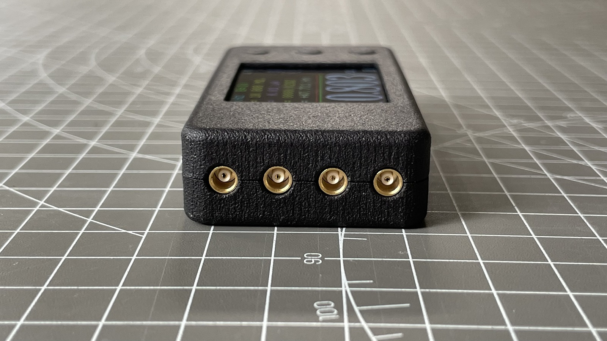
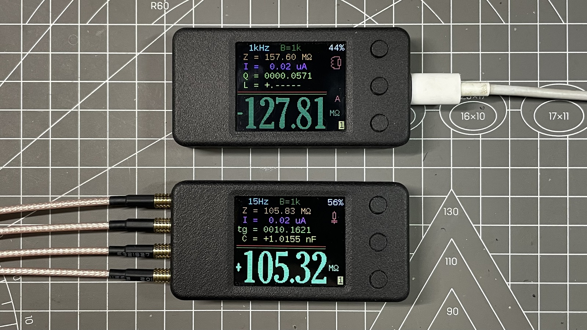
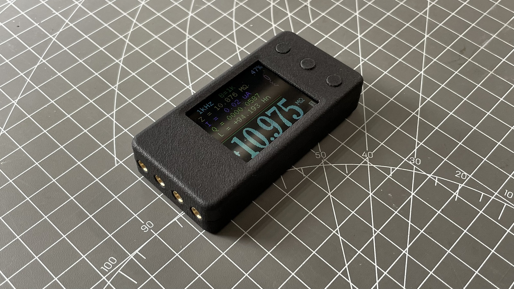
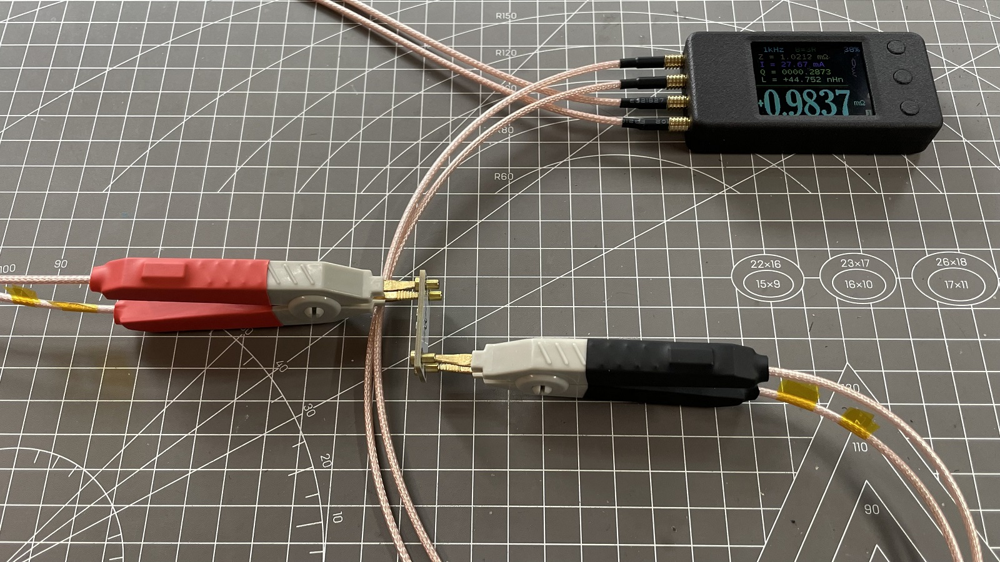

## mR-71-RE

mR-71-RE 是基于 [Andrey_B](https://www.radiokot.ru/forum/memberlist.php?mode=viewprofile&u=21307) 的作品[交流欧姆表 mR-71](https://radiokot.ru/artfiles/6673/) 修改的

|  |
| ------------------------------------------ |

## 关于

mR-71 重制版的制造文件（mR-71 Remastered version manufacturing files）

你第一次接触到本套文件可能是压缩包，制造文件的版本可能滞后于仓库，制作前请访问[仓库地址](https://github.com/oldgerman/mR-71-RE)检查更新

The first time you come into contact with this set of files, it may be a compressed package, and the content may lag behind the warehouse. Please visit the [github](https://github.com/oldgerman/mR-71-RE) to check for updates before making


|  |  |
| ------------------------------------------------------------ | ------------------------------------------ |
|                    |  |

### 路径下各个文件夹的说明

```c
├─BOM                             // # PCB的物料清单
├─Gerber                          // # 打板文件
│  ├─Kelvin_Clip_RG316_To_PCB     // ## 【2层，板厚1.6mm】RG316转接板
│  ├─Kelvin_RES                   // ## 【2层，板厚1.6mm】开尔文焊盘电阻测试板
│  ├─mR-71-RE                     // ## 【4层，板厚1.0mm】主板PCB打样文件
│  └─mR-71_RE_Stencil             // ## 主板开钢网的文件
├─Hex                             // # 固件: 反汇编修改v0.2固件，以适配IPS屏幕
├─Images                          // # 图片
├─Schematic                       // # 原理图
└─STL                             // # 3D打印模型
    ├─link_parts                  // ## 连接模型
    └─single_parts                // ## 单个模型
```

### 注意事项

- 主板PCB打板厚度是1mm，否则外壳会装配不好
- PCB、原理图、钢网、外壳文件后续可能会改动，以最新的日期时间为准！

### 了解更多

- [mR-71-RE_组装指南](https://github.com/oldgerman/mR-71-RE/tree/master/mR-71-RE_组装指南.md)
- [mR-71-RE_校准测试](https://github.com/oldgerman/mR-71-RE/tree/master/mR-71-RE_校准测试.md)

### 更新日志

| 日期      | 概述                                   | 文件版本变动      | 备注                                                         |
| --------- | -------------------------------------- | ----------------- | ------------------------------------------------------------ |
| 2024-0319 | 首次发布                               | 主机PCB版本：v1.0 | 组装教程、3D打印外壳也都上传了                               |
| 2024-0321 | 更新主机PCB版本、钢网、原理图          | 主机PCB版本：v1.1 | 还添加了小于20%沉金面积版本，后缀Gold                        |
| 2024-0322 | 更新电阻测试                           | 无                | 三个频率下测量：1%的1mΩ到100mΩ 采样电阻、0.1%的1Ω到1MΩ薄膜电阻 |
| 2024-0325 | 更新电容测试，成品图                   | 无                | 三个频率下测量：10pF到10uF的MLCC                             |
| 2024-0327 | 添加mR-71-RE上板和下板单独的Gerber文件 | 无                | 详见mR-71-RE的[Gerber文件说明](](https://github.com/oldgerman/mR-71-RE/Gerber/mR-71-RE/README.md) |

## 致谢

- 感谢[mR-71](https://radiokot.ru/artfiles/6673/)原作者[Andrey_B](https://www.radiokot.ru/forum/memberlist.php?mode=viewprofile&u=21307)
- 感谢一同玩mR-71的老友们
- 感谢 JLC 和 JP 的板子

## 许可协议

[CC BY-NC-SA 4.0 DEED | 署名-非商业性使用-相同方式共享 4.0 国际](https://creativecommons.org/licenses/by-nc-sa/4.0/deed.zh-hans)


