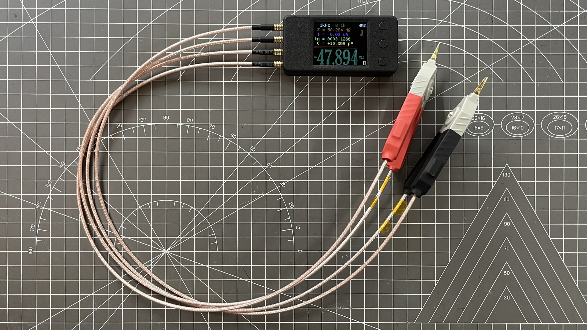

## mR-71-RE

mR-71-RE 是基于 [Andrey_B](https://www.radiokot.ru/forum/memberlist.php?mode=viewprofile&u=21307) 的作品 [交流欧姆表 mR-71](https://radiokot.ru/artfiles/6673/) 修改的

|  |
| ------------------------------------------ |

## 关于

mR-71 重制版的制造文件（mR-71 Remastered version manufacturing files）

你第一次接触到本套文件可能是压缩包，制造文件的版本可能滞后于仓库，制作前请访问[仓库地址](https://github.com/oldgerman/mR-71-RE)检查更新

The first time you come into contact with this set of files, it may be a compressed package, and the content may lag behind the warehouse. Please visit the [github](https://github.com/oldgerman/mR-71-RE) to check for updates before making


|  |  |
| ------------------------------------------------------------ | ------------------------------------------ |
|                    |  |

### 路径下各个文件夹的说明

```c
├─AD_Projects                     // # PCB的源文件
│  └─MR-71_RE0                    // # 原版mR-71重绘工程
├─BOM                             // # PCB的物料清单
├─Gerber                          // # 打板文件
│  ├─Kelvin_Clip_RG316_To_PCB     // ## 【2层，板厚1.6mm】RG316转接板
│  ├─Kelvin_RES                   // ## 【2层，板厚1.6mm】开尔文焊盘电阻测试板
│  ├─mR-71-RE                     // ## 【4层，板厚1.0mm】主板PCB打样文件
│  └─mR-71_RE_Stencil             // ## 主板开钢网的文件
├─Hex                             // # 固件: 反汇编修改v0.2固件，以适配IPS屏幕
├─Images                          // # 图片
├─Schematic                       // # 原理图
├─SMT                             // # SMT文件
└─STL                             // # 3D打印模型
    ├─link_parts                  // ## 连接模型
    └─single_parts                // ## 单个模型
```

### 快速下载某个文件

如果你想单独下载某个文件，可以顺着文件路径一路点击到对应的文件，点击下载raw文件：


### 注意事项

- 主板 PCB 打板厚度是 1mm，否则外壳会装配不好
- PCB、原理图、钢网、外壳文件后续可能会改动，以最新的日期时间为准！

### 了解更多

- [mR-71-RE组装指南](https://oldgerman.github.io/1d2ecca7/)（网页版，可以使用浏览器翻译），本仓库根目录有 PDF 版
- [mR-71-RE校准测试](https://oldgerman.github.io/b8304ba5/)（网页版，可以使用浏览器翻译），本仓库根目录有 PDF 版

### 更新日志

| 日期      | 概述                                                         | 制造文件变动        | 备注                                                         |
| --------- | ------------------------------------------------------------ | ------------------- | ------------------------------------------------------------ |
| 2024-0319 | 首次发布                                                     | 主机 PCB 版本：v1.0 | 组装教程、3D 打印外壳也都上传了                              |
| 2024-0321 | 更新主机 PCB 版本、钢网、原理图                              | 主机PCB版本：v1.1   | 还添加了小于 20% 沉金面积版本，后缀 Gold                     |
| 2024-0325 | 更新成品图                                                   | 无                  | 无                                                           |
| 2024-0327 | 添加 mR-71-RE 上板和下板单独的 Gerber 文件                   | 无                  | 详见 [Gerber文件说明：mR-71-RE](https://github.com/oldgerman/mR-71-RE/blob/master/Gerber/mR-71-RE/README.md) |
| 2024-0408 | 添加 组装指南 和 校准测试 网页版文章的 PDF 版                | 原理图、BOM、ibom   | 网页版文章的 PDF 版在仓库根目录下                            |
| 2024-0416 | 添加 Kelvin_RES 焊盘 2512 和 1206 单独的 Gerber 文件         | 无                  | 详见 [Gerber文件说明：Kelvin_RES](https://github.com/oldgerman/mR-71-RE/blob/master/Gerber/Kelvin_RES/README.md) |
| 2024-0418 | 修正 BOM 表 R31 R32 封装，从 0402 改为 0603                  | 原理图、BOM         | 物料种类未变                                                 |
| 2024-0420 | 修正 BOM 表 C22 厂家型号为 CL05B103KB5NNNC                   | BOM                 | 物料种类变化                                                 |
| 2024-0430 | 重命名交互式 BOM 文件 20240408_MR-71_RE6_BOM.html 为 20240420_MR-71_RE6_BOM.html | ibom                | 仅重命名，防止不必要的误解（以为 BOM 更新了但 ibom 还是旧版本对不上号） |
| 2024-0511 | 添加 mR-71-RE 的 SMT 坐标文件                                | 坐标文件            | 不同 PCB 需使用对应的坐标文件，在 [SMT](https://github.com/oldgerman/mR-71-RE/blob/master/SMT) 文件夹 |
| 2024-0512 | 添加 AD 重绘的原版 mR-71 工程                                | 无                  | 详见 [源文件说明：mR-71-RE0](https://github.com/oldgerman/mR-71-RE/blob/master/AD_Projects/MR-71_RE0/README.md) |
| 2024-0624 | 添加 Kelvin_RES 焊盘 2512 和 1206 单元的 Gerber 文件         | 无                  | 详见 [Gerber文件说明：Kelvin_RES](https://github.com/oldgerman/mR-71-RE/blob/master/Gerber/Kelvin_RES/README.md) |

## 致谢

- 感谢 [mR-71](https://radiokot.ru/artfiles/6673/) 原作者 [Andrey_B](https://www.radiokot.ru/forum/memberlist.php?mode=viewprofile&u=21307)
- 感谢一同玩 mR-71 的老友们
- 感谢 JLC 和 JP 的板子

## 许可协议

[CC BY-NC-SA 4.0 DEED | 署名-非商业性使用-相同方式共享 4.0 国际](https://creativecommons.org/licenses/by-nc-sa/4.0/deed.zh-hans)


