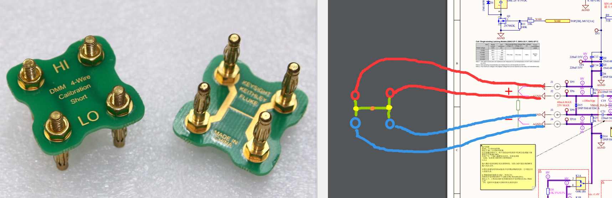
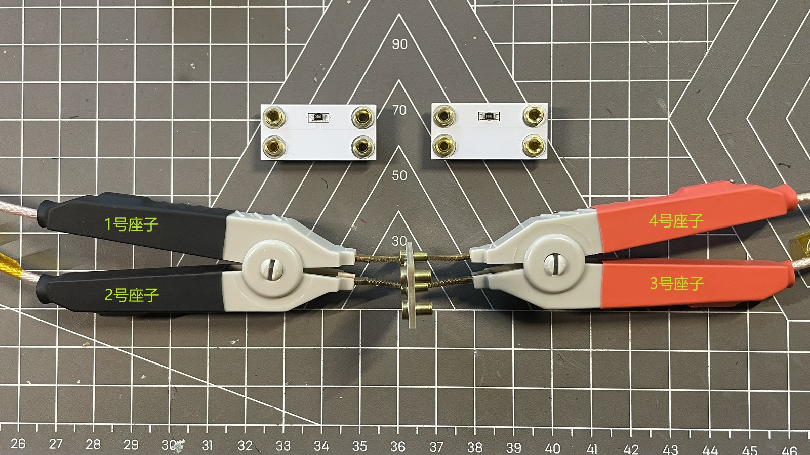
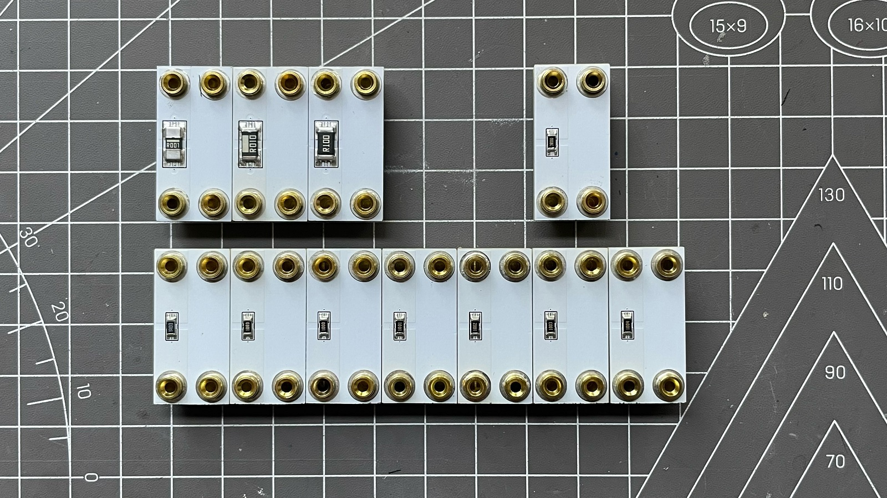
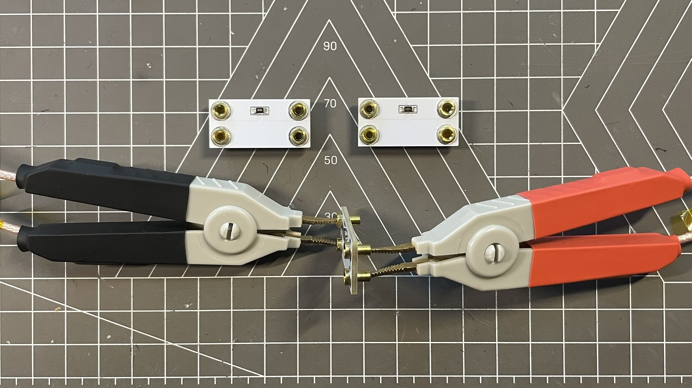

## 校准

### 开路短路+电阻校准

参见[原文](https://radiokot.ru/artfiles/6673/)

校准后的一些测量效果：

| .JPG) | .JPG) |
| ---------------------------------------------------------- | ---------------------------------------------------------- |
| 3Ω 0.1%                                                    | 1KΩ 0.1%                                                   |
| .JPG) | .JPG) |
| 4线短路                                                    | 10mΩ 1%                                                    |

### 问题：开路短路校准后，短路夹子时，各个频率还显示2mR以上？

开路短路校准和电阻校准后，短路夹子时各个挡位可能还会有2mR以上的底噪，测量毫欧电阻时总是要开启相对测量不太方便

这种情况可以再开路短路校准一次（不用电阻校准），但夹子短路时需要中间两座子先互相短路，然后边上俩座子互相短路，最后两个短路节点互相短路，这样后，短路夹子时，15和1K频率挡可以小于0.05mR（100K频率短路夹子示数仍然不太稳定，建议测量时开启相对测量）

参考keithley的短路板，接法如原理图示意

可以使用开尔文电阻测试板，两个开尔文夹子按照上图的示意，只夹同一侧的2个K2A33座子，座子编号为机身正面从上到下依次是1、2、3、4号

## 测试

> 由于个人的条件有限，测试不会覆盖到量程全范围

### 原版mR-71测量性能

- 同时测量值：R、C/L、Q/tg、Z
- 测试信号跨度：不大于±100mV Vp-p
- 通过被测电路的电流（显示）：不大于40mA
- 测量频率：15Hz、1kHz、100kHz
- 连接：4 线（开尔文）
- 被测电路去耦直流电压：≤±25V
- 自动选择等效方案
- 自动选择量程
- 支持相对测量模式（R、L、C）

测量范围： 

- R：1mOhm...1MOhm，分辨率从 1mkOhm 起
- L：1nH...10H，分辨率从 10pH 开始
- C：10pF...100000uF（100mF），分辨率0.1pF

### 重制版mR-71先决条件

> 仪表放大器的增益电阻用3.6K 0.1% 叠焊300K 0.1%
>
> 3R挡下各个频率下夹子短路的值
>
> - 15Hz：最大+0.03mR
> - 1KHz：最大-0.01mR
> - 100KHz：最大+1.60mR
>
> 测量时，未开启相对测量模式，水平方向左右各一个夹子的夹测试件（如下右图示意），机子需远离手机等干扰源
>
> 在测量范围边界时，100K 频率下的测量值受两个夹子之间的距离，夹子距离主机的距离影响较大

### 测量：电阻

> 省略副参

|  |  |
| -------------------------------------------- | ------------------------------------------------------------ |

| 型号                                                         | 阻值  | 精度 | 温漂     | 功率  | 封装 | 挡位 | 频率：15Hz        | 频率：1KHz        | 频率：100KHz      | 备注：15Hz                               | 备注：1KHz                             | 备注：100KHz                                                 |
| ------------------------------------------------------------ | ----- | ---- | -------- | ----- | ---- | ---- | ----------------- | ----------------- | ----------------- | ---------------------------------------- | -------------------------------------- | ------------------------------------------------------------ |
| [PA2512FKE7W0R001E ](https://item.szlcsc.com/306664.html)    | 1mΩ   | 1%   | ±50ppm/℃ | 2W    | 2512 | 3Ω   | 0.9878mΩ±0.0249mΩ | 0.9871mΩ±0.0068mΩ | 0.9239mΩ±1.1506mΩ | 示数明显不稳定，在0.9629mΩ到1.0126mΩ跳动 | 示数不太稳定，在0.9804mΩ到0.9939mΩ跳动 | 示数随夹子距离机身的距离影响很大，0~10cm距离变化，在-0.2267mΩ到2.0745mΩ跳动 |
| [PA2512FKE7W0R01E ](https://item.szlcsc.com/347965.html)     | 10mΩ  | 1%   | ±50ppm/℃ | 2W    | 2512 | 3Ω   | 10.026mΩ          | 10.024mΩ          | 9.8346mΩ±0.6574mΩ | 示数较稳定                               | 示数较稳定                             | 示数随夹子距离机身的距离影响很大，0~10cm距离变化，在9.1772mΩ到10.492mΩ跳动 |
| [HoJLR2512-3W-100mR-1% ](https://item.szlcsc.com/3159230.html) | 100mΩ | 1%   | ±50ppm/℃ | 3W    | 2512 | 3Ω   | 99.496mΩ          | 99.384mΩ          | 99.416mΩ±0.4735mΩ | 示数较稳定                               | 示数较稳定                             | 示数随夹子距离机身的距离影响较大，0~10cm距离变化，在98.942mΩ到99.889mΩ跳动 |
| [RT1206BRD071RL ](https://item.szlcsc.com/528541.html)       | 1Ω    | 0.1% | ±25ppm/℃ | 250mW | 1206 | 3Ω   | 1.0020Ω           | 1.0019Ω           | 1.0022Ω           | 示数较稳定                               | 示数较稳定                             | 示数较稳定                                                   |
| [ARG06BTC0100](https://item.szlcsc.com/2977350.html)         | 10Ω   | 0.1% | ±25ppm/℃ | 250mW | 1206 | 3Ω   | 9.9893Ω           | 9.9897Ω           | 9.9968Ω           | 示数较稳定                               | 示数较稳定                             | 示数较稳定                                                   |
| [ARG06BTC1000](https://item.szlcsc.com/2977355.html)         | 100Ω  | 0.1% | ±25ppm/℃ | 250mW | 1206 | 3Ω   | 99.673Ω           | 99.607Ω           | 100.01Ω           | 示数较稳定                               | 示数较稳定                             | 示数较稳定                                                   |
| [ARG06BTC1001](https://item.szlcsc.com/395099.html)          | 1KΩ   | 0.1% | ±25ppm/℃ | 250mW | 1206 | 1KΩ  | 1.0001KΩ          | 1.0000KΩ          | 998.37Ω           | 示数较稳定                               | 示数较稳定                             | 示数较稳定                                                   |
| [ARG06BTC1002](https://item.szlcsc.com/395100.html)          | 10KΩ  | 0.1% | ±25ppm/℃ | 250mW | 1206 | 1KΩ  | 9.9750KΩ          | 9.9774KΩ          | 10.198KΩ          | 示数较稳定                               | 示数较稳定                             | 示数较稳定                                                   |
| [ARG06BTC1003](https://item.szlcsc.com/395101.html)          | 100KΩ | 0.1% | ±25ppm/℃ | 250mW | 1206 | 1KΩ  | 100.27KΩ          | 100.44KΩ          | 102.41KΩ          | 示数较稳定                               | 示数较稳定                             | 示数较稳定                                                   |
| [ARG06BTC1004](https://item.szlcsc.com/3426034.html)         | 1MΩ   | 0.1% | ±25ppm/℃ | 250mW | 1206 | 1KΩ  | 1.0251MΩ±0.0299MΩ | 1.0248MΩ±0.0271MΩ | 803.50K±27.150K   | 示数较稳定                               | 示数较稳定                             | 示数明显不稳定，在995.18KΩ到1.0551MΩ跳动                     |

### 测量：电容

> 省略副参

1pF到100nF，MLCC，C0G，±5%：

| 型号                                                      | 容值  | 材质 | 精度 | 封装 | 挡位       | 频率：15Hz        | 频率：1KHz        | 频率：100KHz      |
| --------------------------------------------------------- | ----- | ---- | ---- | ---- | ---------- | ----------------- | ----------------- | ----------------- |
|                                                           | 1pF   |      |      | 0402 | 1K，1K，1K |                   |                   |                   |
| [CL10C5R6CB8NNNC](https://item.szlcsc.com/299799.html)    | 5.6pF | C0G  | ±5%  | 0603 | 1K，1K，1K | 测不出来          | 19.000pF±4.000pF  | 6.3518pF±0.0084pF |
| [CL10C100DB8NNNC](https://item.szlcsc.com/181524.html)    | 10pF  | C0G  | ±5%  | 0603 | 1K，1K，1K | 测不出来          | 12.483pF±0.670pF  | 10.651pF±0.017pF  |
| [CC0603FRNPO0BN101 ](https://item.szlcsc.com/545465.html) | 100pF | C0G  | ±1%  | 0603 | 1K，1K，1K | 测不出来          | 88.184pF±0.931pF  | 96.348pF±0.026pF  |
| [0402CG102J500NT ](https://item.szlcsc.com/54563.html)    | 1nF   | C0G  | ±5%  | 0402 | 1K，1K，1K | 1.6690nF±0.8750nF | 1.0153nF±0.0008nF | 967.08pF±0.07pF   |
| [GRM1885C1H103JA01D ](https://item.szlcsc.com/87149.html) | 10nF  | C0G  | ±5%  | 0603 | 1K，1K，1K | 9.3150nF±0.2350nF | 10.052nF±0.001nF  | 9.8261nF±0.0010nF |
| [GRM31C5C1H104JA01L ](https://item.szlcsc.com/99155.html) | 100nF | C0G  | ±5%  | 1206 | 1K，3Ω，3Ω | 98.697nF±0.2060nF | 98.737nF±0.318nF  | 99.333nF±0.001nF  |

1uF到100uF，MLCC，X5R或X7R，±10%（大于1uF已经没有C0G电容了）

| 型号                                                       | 容值  | 材质 | 精度 | 封装 | 挡位       | 频率：15Hz        | 频率：1KHz        | 频率：100KHz      |
| ---------------------------------------------------------- | ----- | ---- | ---- | ---- | ---------- | ----------------- | ----------------- | ----------------- |
| [CL10A105KB8NNNC](https://item.szlcsc.com/16531.html)      | 1uF   | x5R  | ±10% | 0603 | 1K，1K，1K | 795.99nF±0.15nF   | 794.09nF±0.27nF   | 720.03nF±0.16nF   |
| [CL31A106KBHNNNE](https://item.szlcsc.com/14236.html)      | 10uF  | x7R  | ±10% | 1206 | 3Ω，3Ω，3Ω | 7.0731uF±0.0586uF | 7.0041uF±0.0027uF | 7.2273uF±0.0005uF |
| [GRM31CR60J107KEA8L](https://item.szlcsc.com/3591172.html) | 100uF | x5R  | ±10% | 1206 |            |                   |                   |                   |

1uF到100uF，普通钽电容，±10%

| 型号 | 容值  | 材质 | 精度 | 封装 | 挡位       | 频率：15Hz | 频率：1KHz | 频率：100KHz |
| ---- | ----- | ---- | ---- | ---- | ---------- | ---------- | ---------- | ------------ |
|      | 1uF   | 钽   | ±10% |      | 3Ω，3Ω，3Ω |            |            |              |
|      | 10uF  | 钽   | ±10% |      | 3Ω，3Ω，3Ω |            |            |              |
|      | 100uF | 钽   | ±10% |      | 3Ω，3Ω，3Ω |            |            |              |

1uF到100uF，MKP，5%，威世的高级货，待土豪测试

| 型号                                                     | 容值  | 材质 | 精度 | 封装 | 挡位 | 频率：15Hz | 频率：1KHz | 频率：100KHz |
| -------------------------------------------------------- | ----- | ---- | ---- | ---- | ---- | ---------- | ---------- | ------------ |
| [MKP1839510254](https://item.szlcsc.com/3485291.html)    | 1uF   | MKP  | ±5%  | 轴向 |      |            |            |              |
| [MKP1848C61060JK2](https://item.szlcsc.com/4365577.html) | 10uF  | MKP  | ±5%  | 插件 |      |            |            |              |
| [MKP1848C71050JY5](https://item.szlcsc.com/4353947.html) | 100uF | MKP  | ±5%  | 插件 |      |            |            |              |

1mF到1F，±20%：待测试

| 型号 | 容值  | 材质 | 精度 | 封装 | 挡位 | 频率：15Hz | 频率：1KHz | 频率：100KHz |
| ---- | ----- | ---- | ---- | ---- | ---- | ---------- | ---------- | ------------ |
|      | 1mF   |      |      |      |      |            |            |              |
|      | 10mF  |      |      |      |      |            |            |              |
|      | 100mF |      |      |      |      |            |            |              |
|      | 1F    |      |      |      |      |            |            |              |

### 测量：电感

> 省略副参

| 型号 | 感值  | 精度 | 封装 | 频率：15Hz | 频率：1KHz | 频率：100KHz |
| ---- | ----- | ---- | ---- | ---------- | ---------- | ------------ |
|      | 1nH   |      |      |            |            |              |
|      | 10nH  |      |      |            |            |              |
|      | 100nH |      |      |            |            |              |
|      | 1uH   |      |      |            |            |              |
|      | 10uH  |      |      |            |            |              |
|      | 100uH |      |      |            |            |              |
|      | 1mH   |      |      |            |            |              |
|      | 10mH  |      |      |            |            |              |
|      | 100mH |      |      |            |            |              |
|      | 1H    |      |      |            |            |              |
|      | 10H   |      |      |            |            |              |

### 锂电池续航

850mA锂电池，约4到6.5小时

### 锂电池电流

| 状态             | 挡位 | 电流       |
| ---------------- | ---- | ---------- |
| 关机             | N/A  | <1uA       |
| 开机，测试夹开路 | 1KΩ  | 128~129mA  |
| 开机，测试夹短路 | 3Ω   | 192～195mA |
